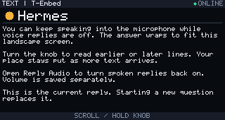

# Hermes landscape text-mode validation

The voice-reply switch, saved preference and current-reply reader were implemented and reviewed on 2026-10-05.

- Workspace host suite: 38 tests passed under the pinned ESP-IDF Python environment.
- Standalone firmware host suite: 11 tests passed, including actual vendored-core and board-menu/NVS harnesses.
- Microphone bridge: 3 tests passed.
- Standalone T-Embed build passed with ESP-IDF `25fe69f946311abdaf9ad56591f25fedbc20ac98`; app size `0x11f260`, 72% of the app partition remains free.
- Landscape framebuffer rendering was inspected for wrapping, title indicator and footer bounds. These images are host renders, not hardware photographs.
- The workspace's legacy `validation/check_controls.py` fails on pre-existing assertions for removed GPIO6/user-button interrupt paths; the unchanged script expects obsolete controls. Current gesture and menu regression tests pass.

Physical speaker cutoff timing, real quiet-speech transcription and restart testing on the board remain pending. Local mute may still allow the gateway to generate/transmit TTS.
